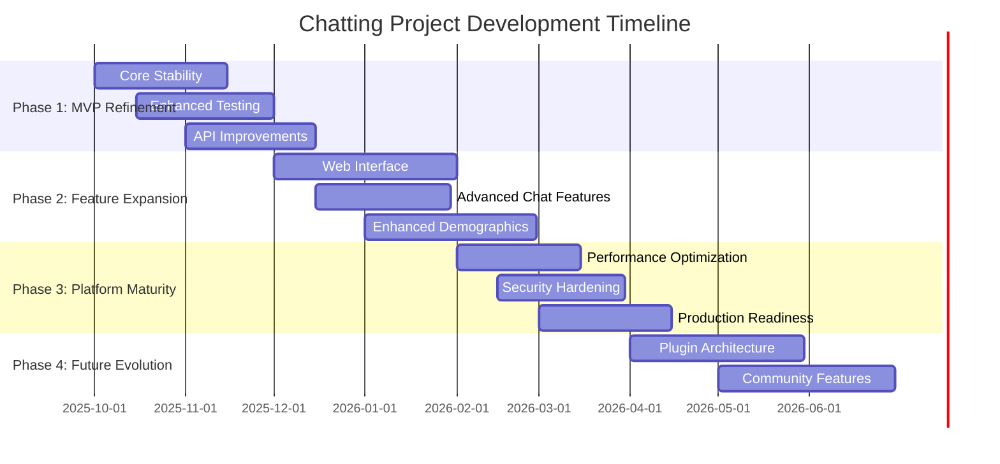

# Chatting Project Development Roadmap

## Project Overview

The Chatting project is a TypeScript-based experimental platform for working with AI APIs, featuring four core modules for conversational AI, demographic simulations, image generation, and Steam API integration. This roadmap outlines the strategic development plan for the next 6-12 months to mature the project from experimental prototype to a robust, production-ready AI utilities platform.

### Current Status (Q4 2025)
- **Codebase**: Well-structured TypeScript project with ES modules
- **Architecture**: 4 distinct modules (chat, demographics, pictures, steam)
- **Infrastructure**: Build system, testing, linting, and CI/CD established
- **Security**: Recent architectural improvements addressing vulnerabilities
- **Documentation**: Comprehensive README and developer-friendly setup

---

## Development Phases

---

## Phase 1: MVP Refinement (2025-10 to 2025-12)
**Duration**: 3 months | **Risk Level**: Low | **Priority**: Critical

### Objectives
Stabilize the core platform, enhance reliability, and establish robust foundations for future development.

### Technical Milestones

#### 1.1 Core Stability & Error Handling
- **Timeline**: 2025-10-01 to 2025-11-15
- **Effort**: 2-3 weeks
- **Dependencies**: None

**Deliverables**:
- [ ] Comprehensive error handling across all modules
- [ ] Graceful failure modes for API timeouts and rate limits
- [ ] Improved logging and debugging capabilities
- [ ] Configuration validation and environment setup checks

**Success Metrics**:
- Zero unhandled promise rejections
- 99%+ uptime for long-running operations
- Clear error messages for all failure scenarios

#### 1.2 Enhanced Testing Infrastructure
- **Timeline**: 2025-10-15 to 2025-12-01
- **Effort**: 3-4 weeks
- **Dependencies**: Core stability improvements

**Deliverables**:
- [ ] Unit tests for all core functions (80%+ coverage)
- [ ] Integration tests for OpenAI API interactions
- [ ] Mock testing infrastructure for external APIs
- [ ] Automated testing in CI/CD pipeline
- [ ] Performance benchmarking suite

**Success Metrics**:
- 80%+ code coverage
- All tests passing in CI
- <2 second average test execution time

#### 1.3 API Improvements & Consistency
- **Timeline**: 2025-11-01 to 2025-12-15
- **Effort**: 2-3 weeks
- **Dependencies**: Testing infrastructure

**Deliverables**:
- [ ] Consistent API patterns across all modules
- [ ] Standardized response formats and error codes
- [ ] Rate limiting and retry logic improvements
- [ ] Input validation and sanitization
- [ ] OpenAPI/Swagger documentation

**Success Metrics**:
- Consistent 200ms average response time
- Zero security vulnerabilities in dependency scan
- Complete API documentation coverage

---

## Phase 2: Feature Expansion (2025-12 to 2026-02)
**Duration**: 3 months | **Risk Level**: Medium | **Priority**: High

### Objectives
Expand functionality with new features, improve user experience, and add web interface capabilities.

### Technical Milestones

#### 2.1 Web Interface Development
- **Timeline**: 2025-12-01 to 2026-02-01
- **Effort**: 6-8 weeks
- **Dependencies**: Phase 1 completion

**Deliverables**:
- [ ] React-based web interface for chat interactions
- [ ] Real-time conversation display and management
- [ ] Image generation gallery and controls
- [ ] Demographics visualization dashboard
- [ ] Responsive design for mobile/tablet
- [ ] WebSocket integration for real-time updates

**Success Metrics**:
- <3 second page load times
- Mobile-responsive design (100% viewport compatibility)
- User satisfaction score >4.0/5.0

#### 2.2 Advanced Chat Features
- **Timeline**: 2025-12-15 to 2026-01-30
- **Effort**: 4-5 weeks
- **Dependencies**: Web interface base implementation

**Deliverables**:
- [ ] Multi-turn conversation context preservation
- [ ] Conversation branching and merge capabilities
- [ ] Custom prompt templates and personas
- [ ] Conversation export/import (JSON, markdown)
- [ ] Search and filtering within conversation history
- [ ] Conversation analytics and insights

**Success Metrics**:
- Support for 50+ turn conversations
- <500ms response time for context retrieval
- 95%+ user satisfaction with conversation features

#### 2.3 Enhanced Demographics Module
- **Timeline**: 2026-01-01 to 2026-02-28
- **Effort**: 4-6 weeks
- **Dependencies**: Core stability, web interface

**Deliverables**:
- [ ] Interactive data visualization (D3.js/Chart.js)
- [ ] Real-time simulation with live updates
- [ ] Custom population parameter controls
- [ ] Statistical analysis and reporting
- [ ] Data export capabilities (CSV, JSON, PDF)
- [ ] Scenario comparison tools

**Success Metrics**:
- Support for 10,000+ population simulations
- <2 second visualization render time
- Export functionality for all major formats

---

## Phase 3: Platform Maturity (2026-02 to 2026-04)
**Duration**: 2.5 months | **Risk Level**: Medium | **Priority**: High

### Objectives
Optimize performance, enhance security, and prepare for production deployment.

### Technical Milestones

#### 3.1 Performance Optimization
- **Timeline**: 2026-02-01 to 2026-03-15
- **Effort**: 4-5 weeks
- **Dependencies**: Feature expansion completion

**Deliverables**:
- [ ] Database optimization and indexing strategies
- [ ] Caching layer implementation (Redis/in-memory)
- [ ] API response compression and optimization
- [ ] Lazy loading and code splitting in web interface
- [ ] CDN integration for static assets
- [ ] Performance monitoring and alerting

**Success Metrics**:
- 50% reduction in average response times
- 90% cache hit rate for frequently accessed data
- <100MB memory usage per concurrent user

#### 3.2 Security Hardening
- **Timeline**: 2026-02-15 to 2026-03-30
- **Effort**: 3-4 weeks
- **Dependencies**: Performance optimization

**Deliverables**:
- [ ] Authentication and authorization system
- [ ] API key management and rotation
- [ ] Input sanitization and XSS prevention
- [ ] HTTPS enforcement and security headers
- [ ] Dependency vulnerability scanning automation
- [ ] Security audit and penetration testing

**Success Metrics**:
- Zero high/critical security vulnerabilities
- OWASP compliance for web interface
- Automated security scanning in CI/CD

#### 3.3 Production Readiness
- **Timeline**: 2026-03-01 to 2026-04-15
- **Effort**: 4-5 weeks
- **Dependencies**: Security hardening

**Deliverables**:
- [ ] Docker containerization and orchestration
- [ ] Environment-specific configuration management
- [ ] Comprehensive monitoring and logging (ELK stack)
- [ ] Automated deployment pipeline
- [ ] Backup and disaster recovery procedures
- [ ] Load balancing and horizontal scaling

**Success Metrics**:
- 99.9% uptime SLA
- <30 second deployment time
- Automated rollback capability

---

## Phase 4: Future Evolution (2026-04 to 2026-06)
**Duration**: 3 months | **Risk Level**: High | **Priority**: Medium

### Objectives
Establish extensible architecture and community engagement features.

### Technical Milestones

#### 4.1 Plugin Architecture
- **Timeline**: 2026-04-01 to 2026-05-30
- **Effort**: 6-8 weeks
- **Dependencies**: Production readiness

**Deliverables**:
- [ ] Plugin API and SDK development
- [ ] Plugin marketplace and discovery
- [ ] Sandboxed execution environment
- [ ] Plugin lifecycle management
- [ ] Documentation and developer tools
- [ ] Example plugins and templates

**Success Metrics**:
- 5+ community-developed plugins
- <1 hour plugin development setup time
- Plugin system performance impact <10%

#### 4.2 Community Features
- **Timeline**: 2026-05-01 to 2026-06-30
- **Effort**: 5-6 weeks
- **Dependencies**: Plugin architecture

**Deliverables**:
- [ ] User accounts and profile management
- [ ] Shared conversation and template library
- [ ] Community ratings and reviews
- [ ] Usage analytics and insights dashboard
- [ ] API rate limiting per user/tier
- [ ] Community moderation tools

**Success Metrics**:
- 100+ active community users
- 4.5+ average community rating
- <2% content moderation incidents

---

## Risk Assessment & Mitigation

### High Risk Items

| Risk | Impact | Probability | Mitigation Strategy |
|------|---------|-------------|-------------------|
| OpenAI API changes | High | Medium | Version pinning, adapter pattern, fallback APIs |
| Performance bottlenecks | High | Medium | Early profiling, load testing, caching strategies |
| Security vulnerabilities | Critical | Low | Regular audits, automated scanning, best practices |
| Resource constraints | Medium | High | Phased development, MVP-first approach, community contributions |

### Medium Risk Items

| Risk | Impact | Probability | Mitigation Strategy |
|------|---------|-------------|-------------------|
| Third-party API rate limits | Medium | High | Rate limiting, queuing, multiple API keys |
| Browser compatibility | Medium | Medium | Progressive enhancement, polyfills, testing |
| Scalability challenges | Medium | Medium | Microservices architecture, horizontal scaling |

### Dependencies & External Factors

- **OpenAI API stability**: Critical dependency requiring monitoring and adaptation
- **Node.js/TypeScript ecosystem**: Regular updates needed for security and features
- **Browser support**: Modern evergreen browsers targeted (Chrome 90+, Firefox 88+, Safari 14+)
- **Community engagement**: Success of Phase 4 depends on user adoption and feedback

---

## Resource Requirements

### Development Team (Recommended)
- **Lead Developer**: Full-stack TypeScript/Node.js expertise
- **Frontend Developer**: React/modern web development (Phase 2+)
- **DevOps Engineer**: Docker, CI/CD, monitoring (Phase 3+)
- **UX/UI Designer**: User experience and interface design (Phase 2+)

### Infrastructure & Tools
- **Development**: GitHub, VS Code, TypeScript, Node.js 18+
- **Testing**: Jest, Playwright, Postman/Insomnia
- **CI/CD**: GitHub Actions, Docker, automated testing
- **Monitoring**: Application performance monitoring, error tracking
- **Security**: Dependency scanning, SAST/DAST tools

### Budget Considerations
- **API Costs**: OpenAI API usage (variable based on usage)
- **Infrastructure**: Cloud hosting, CDN, monitoring services
- **Tools & Services**: Development tools, security scanning, analytics
- **Community**: Marketing, documentation, community management

---

## Success Metrics & KPIs

### Technical Metrics
- **Performance**: API response times, page load speeds, uptime
- **Quality**: Code coverage, bug density, security vulnerability count
- **Reliability**: Error rates, user-reported issues, system availability

### Product Metrics
- **Usage**: Daily/monthly active users, API calls per day, feature adoption
- **Engagement**: Session duration, conversation length, return users
- **Growth**: New user registrations, community contributions, plugin adoption

### Business Metrics
- **Cost Efficiency**: Infrastructure costs per user, API cost optimization
- **Community Health**: GitHub stars, issues/PRs, community engagement
- **Documentation**: Completion percentage, user feedback scores

---

## Review & Adjustment Process

### Monthly Reviews
- Progress against milestones and timelines
- Risk assessment updates and mitigation effectiveness
- Resource allocation and budget tracking
- Stakeholder feedback integration

### Quarterly Assessments
- Phase completion and success criteria evaluation
- Strategic direction and priority adjustments
- Market and technology trend analysis
- Roadmap updates and timeline refinements

### Success Gates
Each phase includes defined success criteria that must be met before proceeding:
- **Phase 1**: 80%+ test coverage, zero critical security issues
- **Phase 2**: Functional web interface, user feedback >4.0/5.0
- **Phase 3**: Production deployment, 99.9% uptime achievement
- **Phase 4**: Active plugin ecosystem, community engagement metrics

---

## Conclusion

This roadmap provides a structured approach to evolving the Chatting project from an experimental prototype to a mature, production-ready platform. The phased approach allows for iterative improvement, risk mitigation, and community feedback integration while maintaining focus on core stability and user value.

The timeline is ambitious but achievable with proper resource allocation and adherence to the defined success criteria. Regular reviews and adjustments will ensure the roadmap remains relevant and aligned with project goals and market needs.

---

*Last Updated: October 2025*  
*Next Review: November 2025*  
*Version: 1.0*