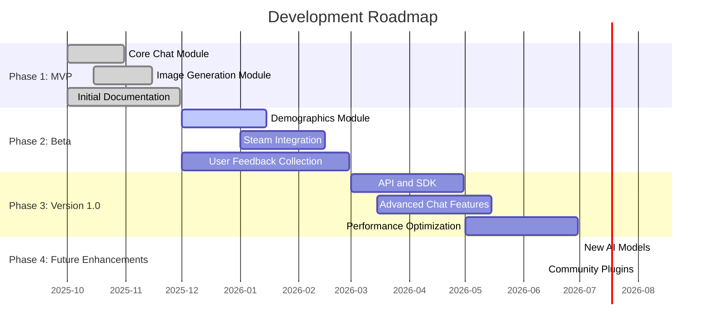

# Development Roadmap

## 1. Project Overview

This project is a collection of TypeScript utilities designed to interact with OpenAI APIs. It provides tools for chat completions, image generation, demographic data simulation, and Steam library analysis. The primary goal is to create a comprehensive and user-friendly platform for developers and researchers to experiment with and build upon AI-powered features.

### 1.1. Project Goals

- **Extensibility**: Design a modular architecture that allows for easy integration of new AI models and services.
- **Usability**: Provide clear documentation and simple interfaces for each module.
- **Performance**: Optimize API interactions for speed and cost-efficiency.
- **Innovation**: Explore novel applications of AI in creative and analytical domains.

### 1.2. Scope

The project scope includes the following modules:

- **Chat Module**: For building and managing conversational AI.
- **Pictures Module**: For generating images with DALL-E.
- **Demographics Module**: For simulating and visualizing population data.
- **Steam Module**: For analyzing gaming data from the Steam platform.

## 2. Development Phases

The development will be organized into the following phases:

- **Phase 1: MVP (Minimum Viable Product)** (Q4 2025)
- **Phase 2: Beta** (Q1 2026)
- **Phase 3: Version 1.0** (Q2 2026)
- **Phase 4: Future Enhancements** (Ongoing)

## 3. Visual Timeline



## 4. Phase Breakdown

### Phase 1: MVP (Minimum Viable Product) - Q4 2025

- **Features**:
  - `-` [ ] Core chat functionality with history.
  - `-` [ ] DALL-E image generation.
  - `-` [ ] Basic documentation.
- **Technical Milestones**:
  - `-` [ ] Setup CI/CD pipeline.
  - `-` [ ] Implement configuration management.
- **Timeline**: 2025-10-01 to 2025-11-30
- **Dependencies**: OpenAI API access.
- **Success Metrics**:
  - `-` [ ] 90% test coverage.
  - `-` [ ] Successful deployment to a staging environment.

### Phase 2: Beta - Q1 2026

- **Features**:
  - `-` [ ] Demographics simulation module.
  - `-` [ ] Steam API integration.
- **Technical Milestones**:
  - `-` [ ] Refactor codebase to improve modularity.
  - `-` [ ] Implement a logging and monitoring solution.
- **Timeline**: 2025-12-01 to 2026-02-28
- **Dependencies**: Steam API key.
- **Success Metrics**:
  - `-` [ ] At least 10 beta testers providing feedback.
  - `-` [ ] Reduction in API error rates by 20%.

### Phase 3: Version 1.0 - Q2 2026

- **Features**:
  - `-` [ ] Public API and SDK.
  - `-` [ ] Advanced chat features (e.g., personas, context management).
- **Technical Milestones**:
  - `-` [ ] Achieve 99.9% API uptime.
  - `-` [ ] Conduct a security audit.
- **Timeline**: 2026-03-01 to 2026-06-30
- **Dependencies**: Finalized API design.
- **Success Metrics**:
  - `-` [ ] 100+ active users.
  - `-` [ ] Positive feedback from the developer community.

### Phase 4: Future Enhancements - Ongoing

- **Features**:
  - `-` [ ] Integration with new AI models (e.g., Claude, Gemini).
  - `-` [ ] Community plugin marketplace.
- **Technical Milestones**:
  - `-` [ ] Develop a plugin architecture.
  - `-` [ ] Automate dependency updates.
- **Timeline**: Ongoing from 2026-07-01
- **Dependencies**: Availability of new AI models.
- **Success Metrics**:
  - `-` [ ] At least 5 community-contributed plugins.
  - `-` [ ] Regular releases with new features.

## 5. Risk Assessment

| Risk | Likelihood | Impact | Mitigation Strategy |
| --- | --- | --- | --- |
| API Rate Limiting | Medium | High | Implement exponential backoff and caching. |
| Data Privacy | Low | High | Anonymize data and follow GDPR best practices. |
| Technical Debt | Medium | Medium | Schedule regular refactoring cycles. |
| Community Engagement | Low | Medium | Promote the project and engage with users on social media. |

## 6. Resource Requirements

- **Development Effort**:
  - **Phase 1 (MVP)**: 2 developers (4 person-months)
  - **Phase 2 (Beta)**: 3 developers (9 person-months)
  - **Phase 3 (v1.0)**: 4 developers (12 person-months)
- **Skills**:
  - **Backend**: TypeScript, Node.js, API design
  - **Frontend**: HTML, CSS, JavaScript (for `demographics` module)
  - **DevOps**: CI/CD, Docker, AWS/Azure
  - **AI/ML**: Experience with OpenAI APIs

## 7. Review Points

- **Monthly**: Review progress against the timeline and adjust priorities as needed.
- **Quarterly**: Re-evaluate the roadmap based on user feedback and market trends.
- **Annually**: Plan the next year's roadmap and review long-term goals.

## 8. Milestone Tracking Template for GitHub Projects

This template can be used to create issues for tracking milestones in GitHub Projects.

```markdown
### Milestone: [Milestone Name]

**Description**: [Brief description of the milestone]

**Status**: [To Do | In Progress | Done]

**Owner**: @[username]

**Due Date**: YYYY-MM-DD

**Tasks**:

- [ ] Task 1 (#issue-number)
- [ ] Task 2 (#issue-number)
- [ ] Task 3 (#issue-number)
```
